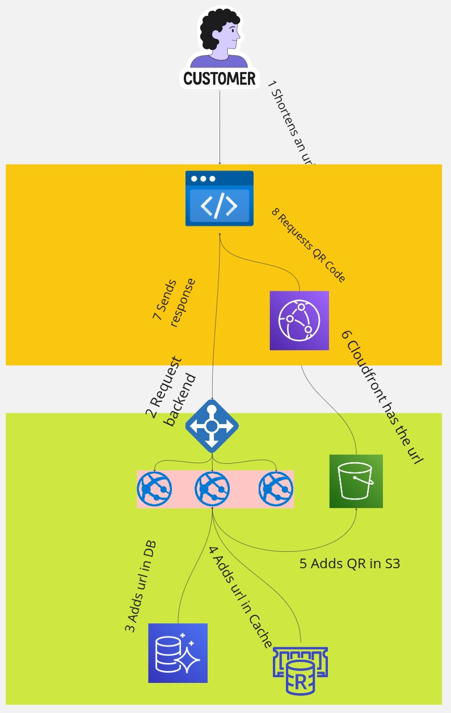

**URL Shortener Project**

    
    
    
    
    
    

 

A simple URL shortening service that allows users to convert long links into short, easy-to-share URLs.

## Features

- 🏷️ **Secure and Fast** – Instantly generates short URLs.
- 🔗 **Automatic Redirection** – The shortened URL redirects users to the original link.
- 🏞️ **QR Code Generation** – Generate a QR code for each shortened URL for easy sharing.

## Technologies Used

- **Backend:** Rust (Actix-web)
- **Database:** PostgreSQL (Amazon Aurora)
- **Frontend:** Vue (Quasar Framework)
- **Storage:** Amazon S3 with CloudFront for QR code image hosting

The project has the following diagram:

 

Below there is a video with a demo run on local machine:

<video width="640" height="360" controls allowfullscreen>
  <source src="assets/demo.mp4" type="video/mp4">
</video>
